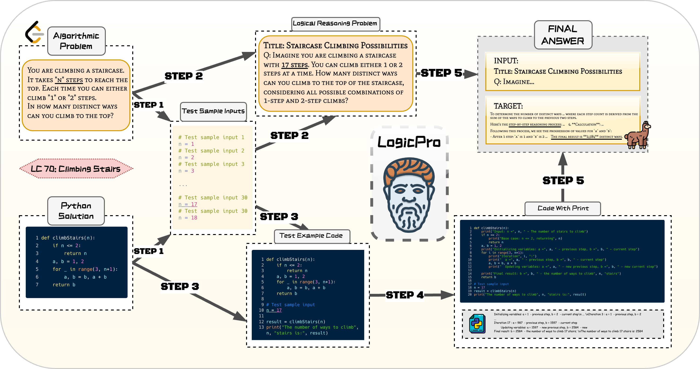

<h1 align="center">

 
LogicPro: Logical Reasoning Enhanced with Program Examples
</h1>

<!-- 

 

 -->

Repo for "<a href="https://arxiv.org/abs/2408" target="_blank">LogicPro: Logical Reasoning Enhanced with Program Examples</a>" [arxiv'2024]

    
         
    <em>An overview of LogicPro. Example: Climbing Stairs (LeetCode 70). </em>

