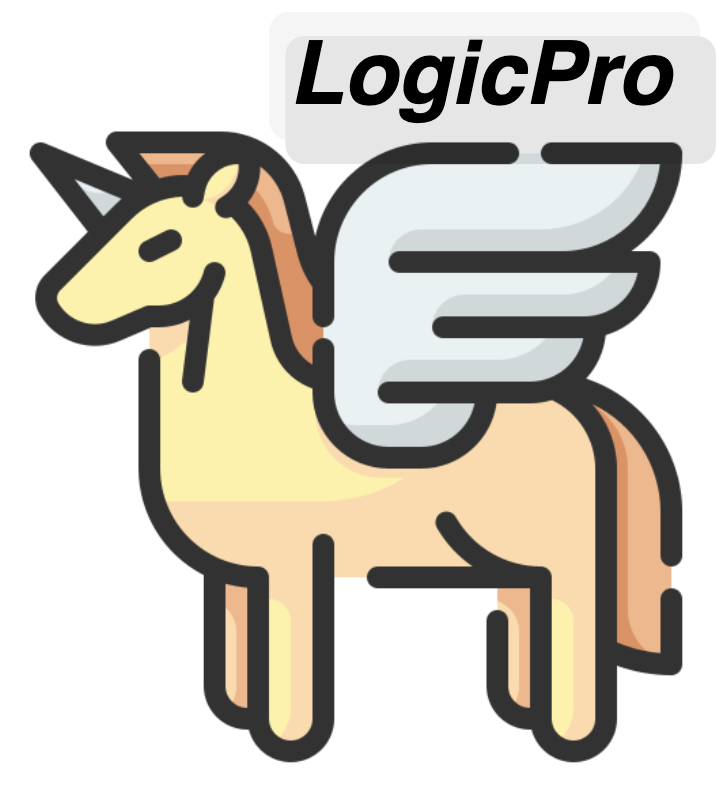

<h1 align="center">

<br>
LogicPro: Logical Reasoning Enhanced with Program Examples
</h1>

<p align="center">
  <a href="https://arxiv.org/abs/2409.12929"><b>[📑 Paper]</b></a> •
  <a href="https://huggingface.co/datasets/jiangjin/LogicPro"><b>[🤗 HF Models]</b></a> •
  <a href="https://github.com/jiangjin1999/LogicPro"><b>[👻 GitHub]</b></a>

</p>

<!-- <p align="center">
Repo for "<a href="https://arxiv.org/abs/2408" target="_blank">LogicPro: Logical Reasoning Enhanced with Program Examples</a>" [arxiv'2024]
</p> -->

<p align="center">
  
  <br>
  <em>An overview of LogicPro. Example: Climbing Stairs (LeetCode 70).</em>
</p>

## 🔥 News
- [2025/02/17] 🔥🔥🔥 LogicPro (500K+) released at [🤗 HuggingFace](https://huggingface.co/datasets/jiangjin/LogicPro)!
- [2024/09/19] LogicPro paper released.

## 💡 Introduction

LogicPro is a data synthesis method that leverages LeetCode-style algorithm **Pro**blems and their corresponding **Pro**gram solutions to generate complex **Logic**al reasoning data in text format. Our approach consists of three key steps:  

1. **Problem Synthesis**: We generate complex reasoning problems based on source algorithm problems and their test cases.  
2. **Answer Generation**: Using standard Python solutions and test cases, we obtain the correct answers and intermediate variable outputs for each problem.  
3. **Reasoning Process Synthesis**: Guided by the intermediate variable outputs, we construct high-quality textual reasoning processes for each problem.  

This method enables us to synthesize reasoning data that is **challenging, scalable, and effective**, while also providing **gold-standard answers** and **high-quality reasoning processes**. With our **540K synthesized dataset**, built from just **2,360 algorithm problems**, LogicPro significantly improves the performance of multiple models on benchmark datasets such as **BBH, LogicBench, DROP, AR-LSAT,** and **GSM8K**, outperforming various existing reasoning datasets.


## ☕️ Citation

If you find this repository helpful, please consider citing our paper:

```
@article{jiang2024logicpro,
  title={LogicPro: Improving Complex Logical Reasoning via Program-Guided Learning},
  author={Jiang, Jin and Yan, Yuchen and Liu, Yang and Jin, Yonggang and Peng, Shuai and Zhang, Mengdi and Cai, Xunliang and Cao, Yixin and Gao, Liangcai and Tang, Zhi},
  journal={arXiv e-prints},
  pages={arXiv--2409},
  year={2024}
}
```